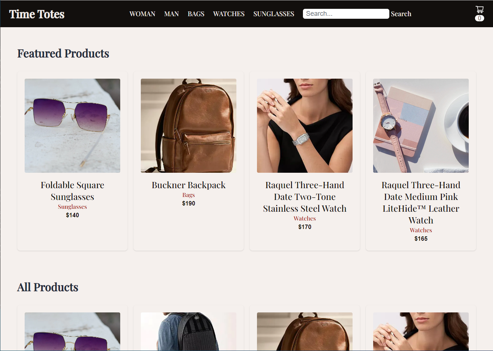
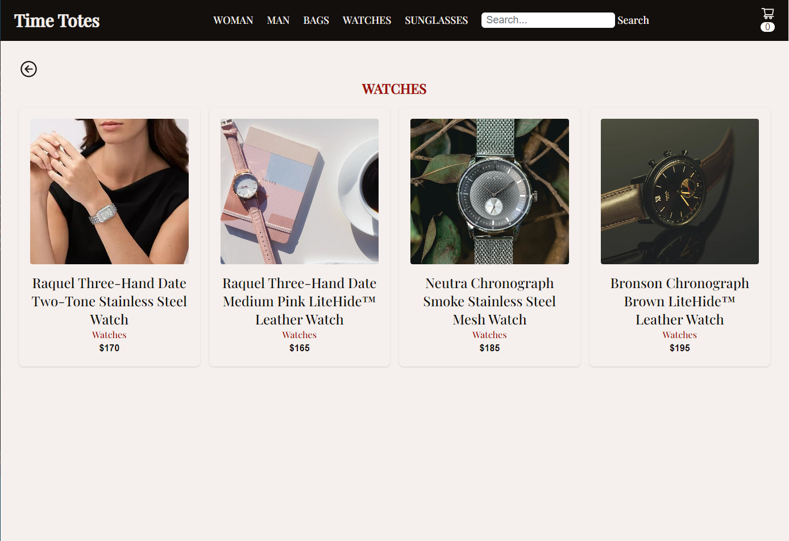
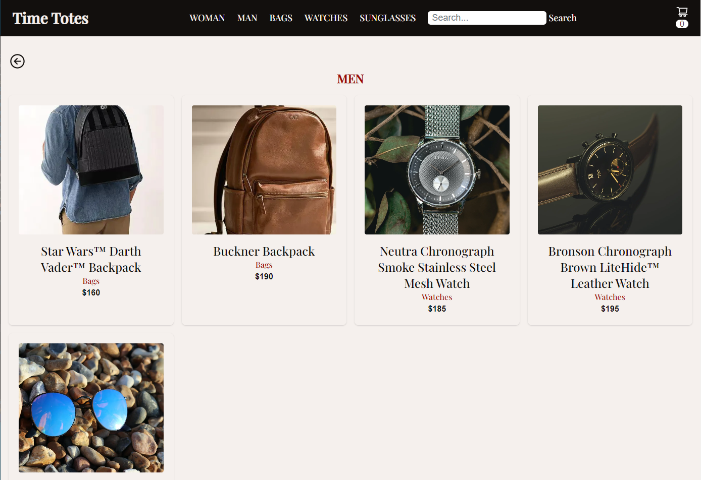
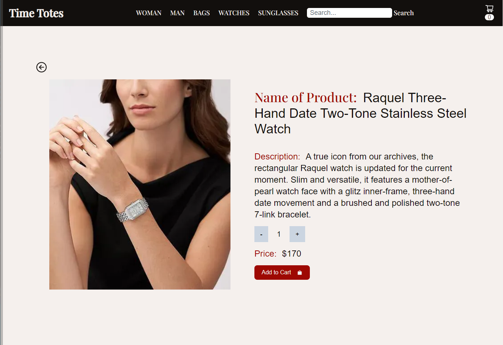

# E-Commerce App for Watches, Bags, and Sunglasses
Our Urban Chronicles App for Watches, Bags, and Sunglasses is a cutting-edge online shopping platform developed using Next.js, React, TypeScript, MongoDB, Stripe, and Tailwind CSS. This feature-rich application provides a seamless and secure shopping experience for users, offering a wide range of products in various categories including watches, bags, and sunglasses, with dedicated sections for both women and men.

     

# Features
 - `Responsive Design:` The app is built with a responsive design, ensuring that users can shop conveniently from any device, whether it's a desktop, tablet, or smartphone.

 - `Search Functionality:` A robust search feature allows users to easily find their desired products by keywords, making the shopping experience quick and efficient.

 - ` Featured Products:` Discover our curated collection of featured products, these handpicked gems and elevate your fashion game with the latest trends and exclusive offers.

- `Product Categories:` The app is divided into distinct categories, including watches, bags, and sunglasses, enabling users to browse and explore products within their specific area of interest.

- `Women and Men Sections:` Tailored sections for women and men ensure that shoppers can easily access products that suit their preferences and style, simplifying the navigation process.

- `Product Details:` Users can view comprehensive product details, including high-quality images, descriptions, prices, and available color and size options, ensuring they have all the information they need to make informed purchase decisions.

- `Stripe Checkout Integration:` The app offers a secure and seamless payment experience through Stripe integration. Users can confidently make payments using various payment methods, including credit/debit cards, ensuring their financial information remains protected.

 - `Tailwind CSS Styling: ` The app's sleek and modern user interface is built using Tailwind CSS, providing a visually appealing and highly customizable design.

# Technologies Used:
 Next.js, React, TypeScript,MongoDB, Stripe, and Tailwind CSS
# Access App:
 https://e-shop-unty.vercel.app/

