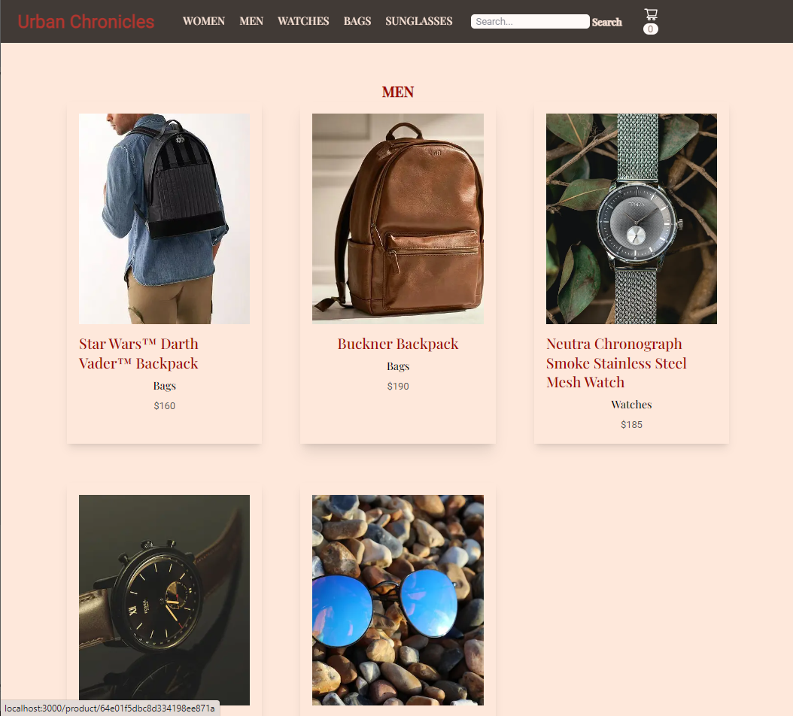
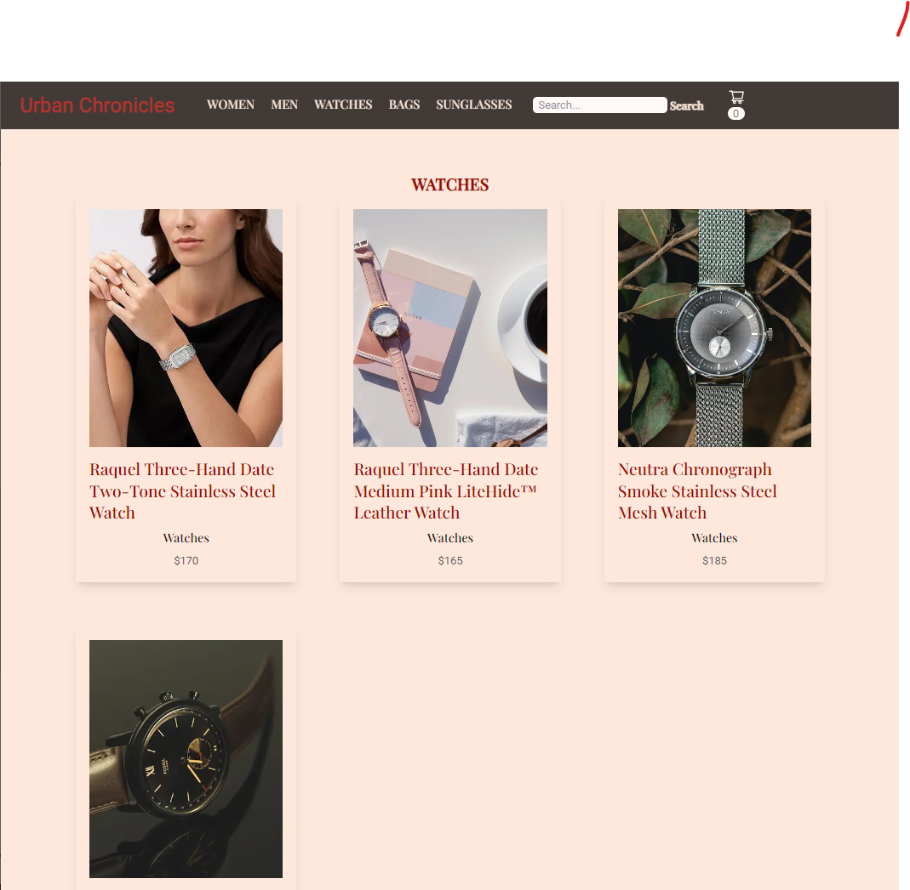
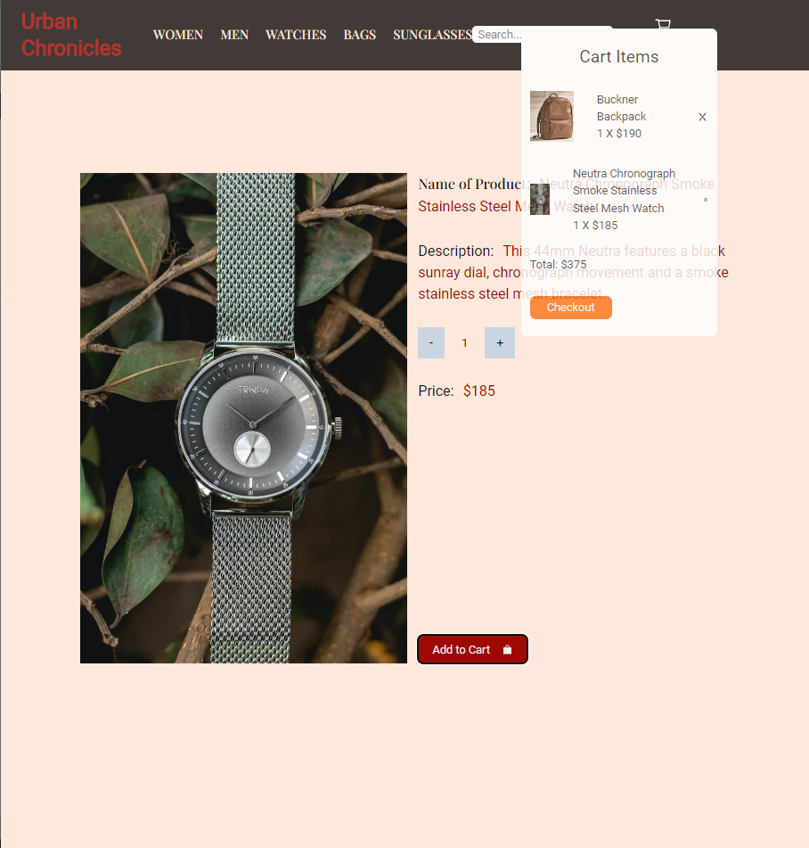
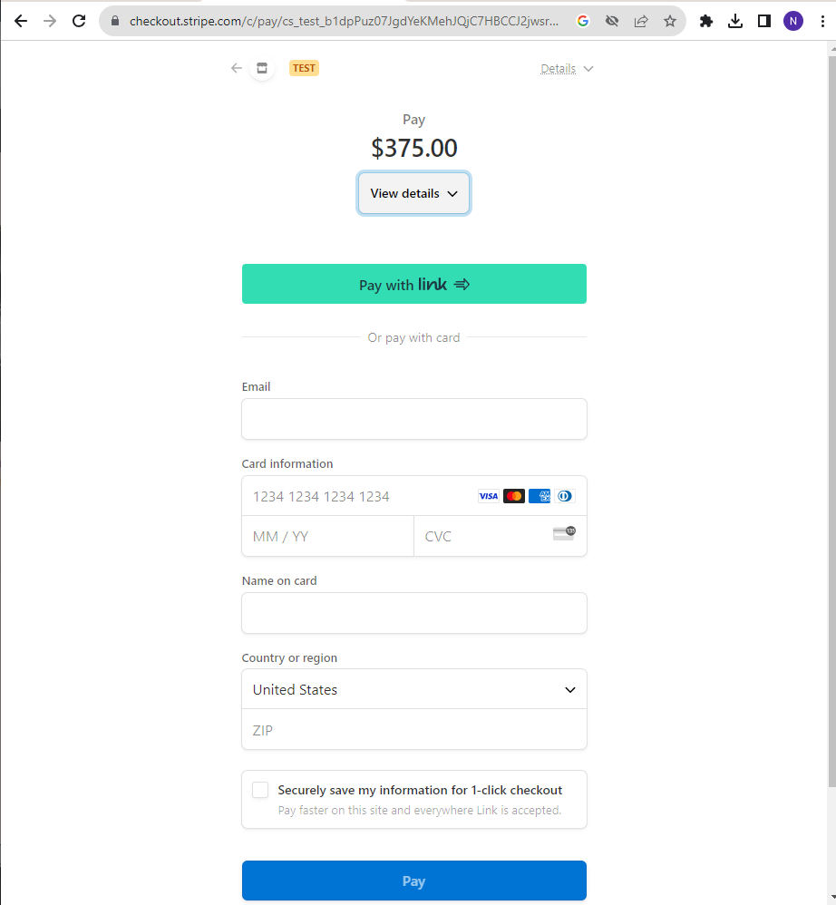

# E-Commerce App for Watches, Bags, and Sunglasses
Our Urban Chronicles App for Watches, Bags, and Sunglasses is a cutting-edge online shopping platform developed using Next.js, React, TypeScript, MongoDB, Stripe, and Tailwind CSS. This feature-rich application provides a seamless and secure shopping experience for users, offering a wide range of products in various categories including watches, bags, and sunglasses, with dedicated sections for both women and men.
</hr>

     

# Features
 - `Responsive Design:` The app is built with a responsive design, ensuring that users can shop conveniently from any device, whether it's a desktop, tablet, or smartphone.

 - `Search Functionality:` A robust search feature allows users to easily find their desired products by keywords, making the shopping experience quick and efficient.

- `Product Categories:` The app is divided into distinct categories, including watches, bags, and sunglasses, enabling users to browse and explore products within their specific area of interest.

-  `Women and Men Sections:` Tailored sections for women and men ensure that shoppers can easily access products that suit their preferences and style, simplifying the navigation process.

- `Product Details:` Users can view comprehensive product details, including high-quality images, descriptions, prices, and available color and size options, ensuring they have all the information they need to make informed purchase decisions.

- `Stripe Checkout Integration:` The app offers a secure and seamless payment experience through Stripe integration. Users can confidently make payments using various payment methods, including credit/debit cards, ensuring their financial information remains protected.

 - `Tailwind CSS Styling: ` The app's sleek and modern user interface is built using Tailwind CSS, providing a visually appealing and highly customizable design.

# Technologies Used:
 Next.js, React, TypeScript,MongoDB, Stripe, and Tailwind CSS
# Access App:

# Next Steps:


This is a [Next.js](https://nextjs.org/) project bootstrapped with [`create-next-app`](https://github.com/vercel/next.js/tree/canary/packages/create-next-app).

## Getting Started

First, run the development server:

```bash
npm run dev
# or
yarn dev
# or
pnpm dev
```

Open [http://localhost:3000](http://localhost:3000) with your browser to see the result.

You can start editing the page by modifying `pages/index.tsx`. The page auto-updates as you edit the file.

[API routes](https://nextjs.org/docs/api-routes/introduction) can be accessed on [http://localhost:3000/api/hello](http://localhost:3000/api/hello). This endpoint can be edited in `pages/api/hello.ts`.

The `pages/api` directory is mapped to `/api/*`. Files in this directory are treated as [API routes](https://nextjs.org/docs/api-routes/introduction) instead of React pages.

This project uses [`next/font`](https://nextjs.org/docs/basic-features/font-optimization) to automatically optimize and load Inter, a custom Google Font.

## Learn More

To learn more about Next.js, take a look at the following resources:

- [Next.js Documentation](https://nextjs.org/docs) - learn about Next.js features and API.
- [Learn Next.js](https://nextjs.org/learn) - an interactive Next.js tutorial.

You can check out [the Next.js GitHub repository](https://github.com/vercel/next.js/) - your feedback and contributions are welcome!

## Deploy on Vercel

The easiest way to deploy your Next.js app is to use the [Vercel Platform](https://vercel.com/new?utm_medium=default-template&filter=next.js&utm_source=create-next-app&utm_campaign=create-next-app-readme) from the creators of Next.js.

Check out our [Next.js deployment documentation](https://nextjs.org/docs/deployment) for more details.
